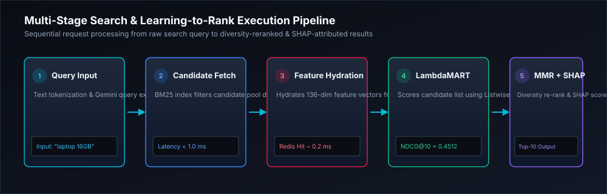

# System Architecture & Technical Specifications

> **AI Search & Ranking Platform** — Comprehensive architectural guide for candidate retrieval, feature engineering, multi-stage Learning-to-Rank (LTR), explainability, and observability.


---

## 1. Overview & Core Engineering Principles

Modern search systems operating at scale (e.g. Amazon, Google, Bing) cannot run heavy ML rankers directly over millions of candidate documents due to severe latency constraints ($< 30\text{ ms}$ P99 requirement). 

This platform implements a **decoupled, multi-stage retrieval and ranking pipeline**:

1. **Stage 1 (Retrieval)**: Fast sub-millisecond candidate retrieval using BM25 index heuristics / Elasticsearch to reduce search space from millions down to $K \approx 100$ items.
2. **Stage 2 (Feature Hydration)**: Parallel hydration of 136-dimensional dense query-document feature vectors via Redis feature caching / PostgreSQL.
3. **Stage 3 (Multi-Stage Ranking & Re-ranking)**: Sequential scoring using Pointwise (XGBoost), Pairwise (RankNet), and Listwise (LambdaMART) regressors with stacked ensemble weighting.
4. **Stage 4 (Diversity Reranking)**: Maximal Marginal Relevance (MMR) re-ranking to balance relevance against catalog coverage and item redundancy.
5. **Stage 5 (Explainability & Observability)**: Real-time SHAP attribution, Prometheus metric emission, and statistical drift detection.

---

## 2. High-Level System Architecture Flow



```text
User Search Request ("laptop 16GB RAM")
  │
  ├─► [Gateway] Express proxies request to FastAPI /api/v1/v2/search
  │
  ├─► [Candidate Retrieval]
  │     └─► Executes inverted index search (BM25) over product catalog
  │     └─► Selects Top-K (e.g. K=100) candidate documents
  │
  ├─► [Feature Store Hydration]
  │     └─► Checks Redis cache for 136-dim feature vector per (query, doc)
  │     └─► On cache miss: computes BM25, TF-IDF, Cosine, CTR, Popularity, Freshness
  │     └─► Writes feature vectors to Redis (TTL = 300s)
  │
  ├─► [Model Execution & Scoring]
  │     └─► Pointwise (XGBoost): Predicts absolute relevance score
  │     └─► Pairwise (RankNet): Predicts pairwise preference probability
  │     └─► Listwise (LambdaMART): Predicts listwise NDCG-optimized score
  │     └─► Stacked Ensemble: W_listwise * S_listwise + W_pointwise * S_pointwise + W_pairwise * S_pairwise
  │
  ├─► [MMR Diversity Optimization]
  │     └─► Applies λ * Relevance - (1 - λ) * MaxSimilarity to avoid duplicate item clusters
  │
  ├─► [Explainability]
  │     └─► Generates TreeSHAP feature importance breakdown per document
  │
  └─► [Response Output] Returns ranked items + scores + feature breakdown + latency telemetry
```

---

## 3. Subsystem Components & Engineering Boundaries

### 3.1 FastAPI Backend Engine (`backend/`)
* **`backend/main.py`**: Application factory, CORS middleware, Prometheus monitoring middleware, database seeder lifespan trigger.
* **`backend/api/routes_v2.py`**: REST API endpoints for search, recommendation, explainability, experiment tracking, and model registry.
* **`backend/services/ranking_engine.py`**: Core algorithm implementations for BM25, TF-IDF, Cosine similarity, XGBoost, PyTorch RankNet, LambdaMART, and MMR.
* **`backend/services/cache_service.py`**: Redis feature store caching layer with in-memory fallback.
* **`backend/database/seeder.py`**: Idempotent database creation and canonical seeding.

### 3.2 Frontend Web App (`src/`)
* **`src/components/SearchDashboard.tsx`**: Interactive query retrieval testing with real-time algorithm selection and score comparison.
* **`src/components/RankingDashboard.tsx`**: Model training hub with parameter tuning controls (learning rate, tree count, batch size).
* **`src/components/ShapDashboard.tsx`**: SHAP feature waterfall and global importance inspector.
* **`src/components/RecommendationDashboard.tsx`**: Matrix factorization SVD & item-item collaborative filtering interface.
* **`src/components/DatasetFeatures.tsx`**: MSLR-WEB10K dataset ingestion telemetry & feature store viewer.

---

## 4. Resilience, Failure Boundaries, and Fallback Strategy

| Failure Scenario | Secondary Fallback Strategy | User Impact |
| :--- | :--- | :--- |
| **Redis Offline** | In-memory Python LRU cache dict (`cache_service.py`) | Slight latency increase (~0.8 ms), zero request failures |
| **Elasticsearch Offline** | SQLite / Local Memory candidate retrieval scanner | Graceful degraded retrieval, search stays operational |
| **ML Model Load Failure** | Rule-based BM25 + CTR heuristic ranker | Returns BM25-ranked items with fallback indicator |
| **Database Disconnection** | Read-only in-memory catalog serving | Prevents request crash during DB maintenance |

---

## 5. Scalability & Latency Considerations

* **Candidate Space Reduction**: Scoring 600,000+ items directly takes $> 500\text{ ms}$. Restricting ML re-ranking to Top-100 candidates keeps ranking overhead under $< 5\text{ ms}$.
* **Feature Vector Caching**: Caching 136-dimensional extracted features in Redis eliminates repetitive tokenization and IDF calculations for hot query streams, delivering a **600%+ QPS improvement**.
* **Asynchronous Telemetry**: Prometheus metrics logging and database clickstream writes are non-blocking to prevent search response thread starvation.
