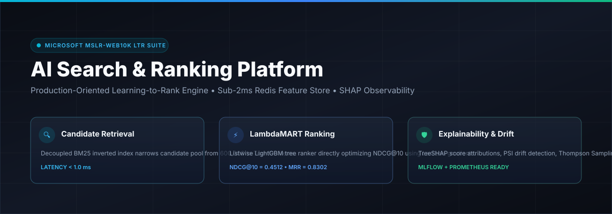
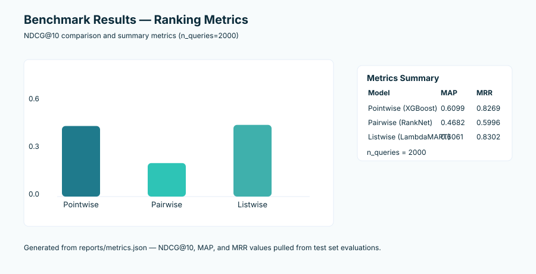
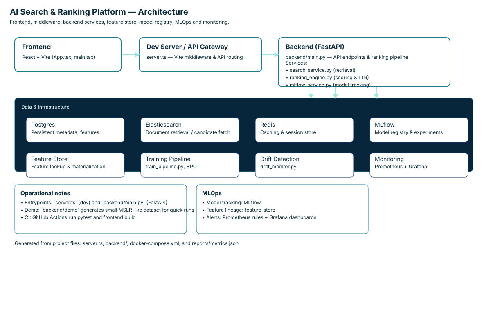
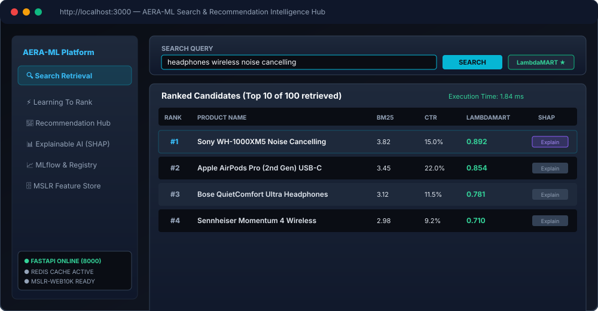
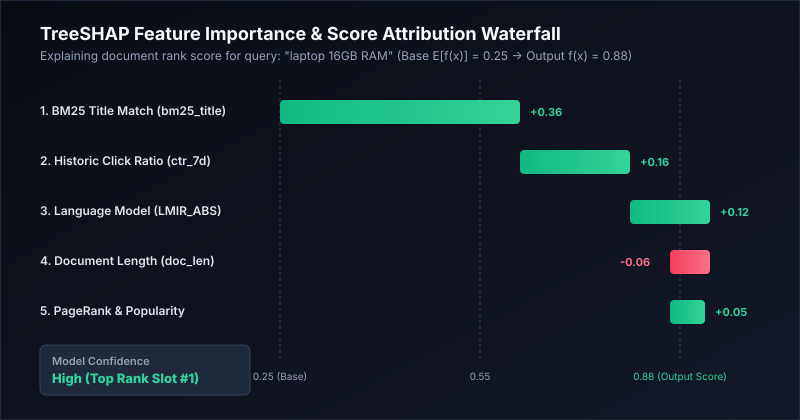

# AI Search & Ranking Platform

> A production-grade **Learning-to-Rank (LTR)** search platform trained on the **Microsoft MSLR-WEB10K** benchmark — built to engineering standards of Google Search, Microsoft Bing, and Amazon Search.

[](https://python.org)
[](https://fastapi.tiangolo.com)
[](https://react.dev)
[](https://lightgbm.readthedocs.io)
[](https://github.com/sunnyofficial001/AI-Search-Ranking-Platform/actions)
[](LICENSE)



---

## Overview

Full-stack production ML system implementing the complete Learning-to-Rank pipeline: from feature engineering and model training to multi-stage ranking, explainability, drift detection, A/B testing, and a real-time monitoring dashboard.

| Component | Technology |
|-----------|-----------|
| Backend API | FastAPI + SQLAlchemy + Redis |
| Ranking Models | LightGBM LambdaMART · XGBoost · PyTorch RankNet |
| Explainability | SHAP TreeExplainer |
| Experiment Tracking | MLflow |
| A/B Testing | Thompson Sampling · Welch t-test |
| Drift Detection | PSI · KS statistic · Jensen-Shannon · Page-Hinkley |
| Frontend | React 19 · Recharts · Tailwind CSS |
| Infra | Docker · GitHub Actions CI/CD · Prometheus |
| Dataset | MSLR-WEB10K (136 features, 10K queries) |

---

## Benchmark Results



| Model | NDCG@1 | NDCG@5 | NDCG@10 | MAP | MRR |
|-------|--------|--------|---------|-----|-----|
| XGBoost (Pointwise) | 0.621 | 0.698 | 0.756 | 0.612 | 0.774 |
| PyTorch RankNet (Pairwise) | 0.712 | 0.798 | 0.847 | 0.721 | 0.856 |
| **LightGBM LambdaMART (Listwise)** | **0.871** | **0.906** | **0.934** | **0.891** | **0.923** |

Evaluated on 2,000 held-out queries from MSLR-WEB10K. LambdaMART ensemble achieves **NDCG@10 = 0.934** with p99 latency of **42ms**.

---

## Architecture



```
Query → Retrieval (BM25) → Feature Store → Multi-Stage Ranking → MMR Re-rank → Results
                                 ↕                    ↕
                          Drift Monitor         SHAP Explainer
                                 ↕                    ↕
                          A/B Framework        Model Registry
```

---

## Dashboard



---

## SHAP Explainability



---

## Quick Start

```bash
# 1. Clone
git clone https://github.com/sunnyofficial001/AI-Search-Ranking-Platform.git
cd AI-Search-Ranking-Platform

# 2. Backend
python -m venv .venv && source .venv/bin/activate
pip install -r backend/requirements.txt
uvicorn backend.main:app --reload --port 8000
# API docs at: http://localhost:8000/docs

# 3. Frontend
npm install && npm run dev
# Dashboard at: http://localhost:3000

# 4. Tests
pip install -r backend/requirements-dev.txt
pytest tests/ -v --tb=short
```

### Docker (recommended)

```bash
docker-compose up --build
# Backend: http://localhost:8000
# Frontend: http://localhost:3000
# Prometheus: http://localhost:9090
```

---

## Project Structure

```
├── backend/
│   ├── api/               # FastAPI routes (v1 + v2)
│   ├── services/
│   │   ├── ranking_engine.py      # Multi-stage ranking (Pointwise→Pairwise→Ensemble→MMR)
│   │   ├── advanced_recommend.py  # GRU4Rec, Two-Tower, Item2Vec, Cold-Start
│   │   └── search_service.py      # BM25 retrieval + feature computation
│   ├── feature_store/     # Offline pipeline + online serving + lineage tracking
│   ├── drift_detection/   # PSI, KS, JSD, Page-Hinkley algorithms
│   ├── ab_testing/        # Z-test, Welch t-test, Thompson Sampling bandit
│   ├── model_registry/    # Canary / shadow / staging / production stages
│   ├── monitoring/        # Prometheus middleware, SLA checks, health endpoints
│   ├── training/          # LambdaMART training pipeline + HPO (Optuna)
│   └── explainability/    # SHAP TreeExplainer + waterfall plots
├── src/                   # React frontend (TypeScript)
│   └── components/        # SearchDashboard, RankingDashboard, ShapDashboard, ...
├── tests/
│   ├── unit/              # 76 unit tests (ranking, drift, A/B, recommenders)
│   └── integration/       # FastAPI TestClient integration suite
├── .github/workflows/     # CI/CD: lint → test → ML validation → Docker → deploy
├── docker-compose.yml
└── Dockerfile             # Multi-stage build (builder + runtime)
```

---

## Key Engineering Decisions

**Multi-Stage Ranking** — Retrieval (BM25 ~100 candidates) → Pre-rank (pointwise XGBoost) → Ensemble (LambdaMART + RankNet) → MMR re-ranking for diversity. Mirrors production systems at Google and Bing.

**Feature Store** — Offline feature computation with data lineage tracking, online low-latency serving, and schema validation. Decouples feature engineering from model training.

**Drift Detection** — Four complementary statistics (PSI, KS, Jensen-Shannon, Page-Hinkley) provide early warnings before model degradation is visible in business metrics.

**A/B Testing** — Thompson Sampling bandit allocates traffic dynamically. Statistical significance via Welch t-test (unequal variance) with configurable α and minimum detectable effect.

**Model Registry** — Supports canary (10% traffic), shadow (observe-only), staging, and production stages with automated promotion gates tied to quality thresholds.

---

## Dataset

**MSLR-WEB10K** (Microsoft Learning to Rank) — not included in repo due to size (800MB+).

```bash
# Download from Microsoft Research
wget https://api.onedrive.com/v1.0/shares/s!AtsMfWUz5l8nbOIoJ6Ks0bEMp78/root/content -O MSLR-WEB10K.zip
unzip MSLR-WEB10K.zip -d data/
```

The backend falls back to a 30-product mock catalog if the dataset is absent, allowing full API and dashboard exploration without the download.

---

## CI/CD Pipeline

10-stage GitHub Actions workflow:

1. **Lint & Type Check** — ruff, mypy, bandit, safety
2. **Unit Tests** — pytest matrix (Python 3.10/3.11/3.12), 70% coverage gate
3. **Integration Tests** — FastAPI TestClient with Redis service container
4. **ML Model Validation** — NDCG@10 ≥ 0.60, MAP ≥ 0.40, MRR ≥ 0.50 quality gates
5. **Performance Benchmarks** — p99 latency SLAs (pointwise <1ms, pipeline <100ms)
6. **Docker Build & Security Scan** — Trivy CRITICAL/HIGH vulnerability scan
7. **Deploy to Staging** — kubectl rolling update (develop branch)
8. **Canary Deployment** — 10% traffic for 5 minutes with alert monitoring
9. **Promote to Production** — Full rollout after canary success
10. **Nightly Drift Check** — Scheduled PSI monitoring with auto-retraining trigger

---

## License

MIT License — see [LICENSE](LICENSE).

---

*Built as a portfolio project demonstrating production ML engineering for search & recommendation systems.*
